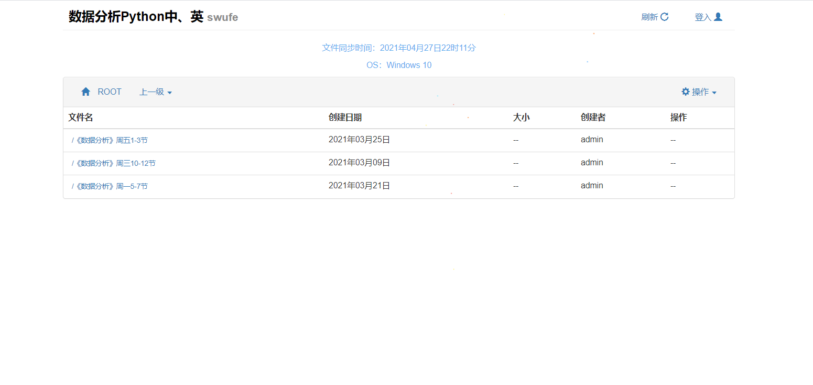

## 欢迎访问NxkSecDIsk源代码资源库！
### Welcome to visit source of NxkSecDisk!



### 简介

NxkSecDisk是踩在了巨人的肩膀上，我们利用了Github上开源的网盘：kiftd 二次制作而成，在此非常感谢作者的无私奉献。如果您需要该版本，请转到以下位置进行浏览和下载：
[kiftd-官方主页](https://kohgylw.gitee.io) 

**我们进行二次开发的目的，是为了使网盘更好的适应上交作业的需求。我们全程使用Github协助开发，主要的改进点为以下几点：**

1. 用户可以在指定文件夹下获得指定权限。
2. 优化了一些前端样式。
3. 添加了全选、多选、连选等快捷键。
4. 搜索功能分为全局搜索、本级搜索，并且未登录用户不能获得搜索权限。
5. 在线预览.ipynb文件。
6. 增加作业文件夹选项，包含了开始、截至日期。
7. 增加点击绽放小球。
8. 增加点击绽放四级单词，让学生在上交作业的时候，还能顺手背单词。

**后续考虑的增加的功能为：**

> 1. 作业文件夹内上传文件时，需要用户手动输入学号+姓名+备注，以此作为文件名。(容易)
> 2. 根据文件夹内文件的“学号+姓名”，导出该“学号+姓名”在每一周是否已经提交。（复杂）
> 3. 作业文件夹内增加分数选项，并且匿名用户无法查看该分数。（容易）
> 4. 增加后台管理面板。（中等）
> 5. 增加文件夹密码功能。（容易）

**但估计本学期都不会再有改动**

> 因为一名核心成员已经坐上前往上海的飞机，前去阿里巴巴某事业部任职，他并非计算机专业，是靠着自学拿下了offer，没有强烈的热爱，是不可能坚持下来的。
>
> 而另一名核心成员成天老想着干饭、干鸡腿、干鸭腿、乐山甜皮鸭、火锅、串串、麻辣香锅、宫保鸡丁、鱼香肉丝、麻婆豆腐、芝士蛋糕、奶油泡芙、芒果布丁、珍珠奶茶、红烧肉、煎带鱼、炸鸡翅、炸鸡腿、周黑鸭、三文鱼、北极贝、帝王蟹、冰淇凌、星冰乐、西米露、西瓜汁、鸡汤、烤鱼、海胆、薯条、汉堡、果冻、吐司

### 作业文件夹功能展示 

创建文件夹：


禁止上传：


文件夹细节：


### 构建说明

_下列条目为kiftd开发环境的基本信息，本网盘维持和原始一样的开发环境，如需对源代码进行查看及编译，推荐使用所列配置。_
+ JDK版本：1.8.0_131
+ 项目管理框架：Maven（m2e 1.8.0 for Eclipse）,Archetype：mavem-archetype-quickstart 1.1。
+ 编码格式：UTF-8
+ 项目资源及配置：Spring Boot+MyBatis+H2 DB，详见pom.xml文档。

### 如何开始

- **仅仅想查看该网盘源码及其功能**
  - 使用Eclipse(javaEE)以项目方式导入本资源文件夹，并设置构建路径中的JDK版本。
  - 使用Maven选项更新项目，并确保pom文件中引入的所有外部资源能够正确引入至本地。
  - 打开edu.swufe.nxksecdisk.Application类，进行测试运行。

- **想将其部署至云服务器**

  - 使用Eclipse(javaEE)以项目方式导入本资源文件夹，并设置构建路径中的JDK版本。
  - 使用Maven选项更新项目，并确保pom文件中引入的所有外部资源能够正确引入至本地。
  - 右键项目，执行Run with选项中的Maven install操作以在target文件夹内编译生成jar程序。
  - 将生成的jar程序拷贝到项目主目录下（即与libs等文件夹同级）并开始使用。

  _提示：源代码路径下包含了一些程序运行所需的非源代码资源（例如程序图标等），某些集成式开发环境（例如IDEA）在编译过程中可能会自动忽略非源代码资源。您需要设置并保证这些资源也能够被正确打包至最终的jar程序内，否则将会导致编译出的程序无法顺利运行。_

- **想对原有的kiftd网盘进行更新**

  - 请复制原kiftd网盘里filesystem里的所有文件夹，覆盖NxkSecDisk里filesystem的所有文件夹。

  - 百度安装h2数据库，这并不大，只有30m左右。

  - 用h2页面端进入NxkSecDisk/filesystem下的kift数据库，账号密码分别为：

    > 账号：root
    > 密码：301537gY

  - 然后使用以下语句，每次一行更新数据库表结构：

    ```sql
    ALTER TABLE FOLDER add column folder_homework TINYINT(1) DEFAULT 0
    ALTER TABLE FOLDER add column folder_homework_start_time VARCHAR(128) DEFAULT NULL
    ALTER TABLE FOLDER add column folder_homework_end_time VARCHAR(128) DEFAULT NULL
    ```

  - 成功后，即可享受作业文件夹功能，根据需求选择上文的**仅仅想查看该网盘源码及其功能、想将其部署至云服务器**进行下一个步骤。

### 程序基本结构说明

我们仅仅做了包重命名的工作，您可以参考kiftd网盘的程序基本结构。

+ 源代码资源文件夹：/src/main/java/
+ 入口类：kohgylw.kiftd.Application
+ web界面请求处理包：kohgylw.kiftd.server.controller、kohgylw.kiftd.server.filter
+ web界面操作逻辑包：kohgylw.kiftd.server.service
+ 核心功能及文件系统实现包：kohgylw.server.util、kohgylw.kiftd.server.listener、kohgylw.kiftd.server.mapper、kohgylw.kiftd.server.model
+ 服务器行为控制类：kohgylw.server.ctl.KiftdCtl
+ 服务器界面相关包：kohgylw.kiftd.ui、kohgylw.kiftd.printer
+ 独立文件管理模块相关包：kohgylw.kiftd.util.file_system_manager
+ 第三方工具使用许可证包：kohgylw.kiftd.util.licenses
+ web页面静态资源文件夹：/webContext/
+ mybatis映射表文件夹：/mybatisResource/
+ 外部引用资源（编译后生成）文件夹：/libs/
+ 引用字体文件夹：/fonts/
+ 设置文件（程序第一次运行后生成）文件夹：/conf/
+ 日志文件夹：/logs/
+ 编译输出文件夹：/target/
+ maven配置文件：/pom.xml

